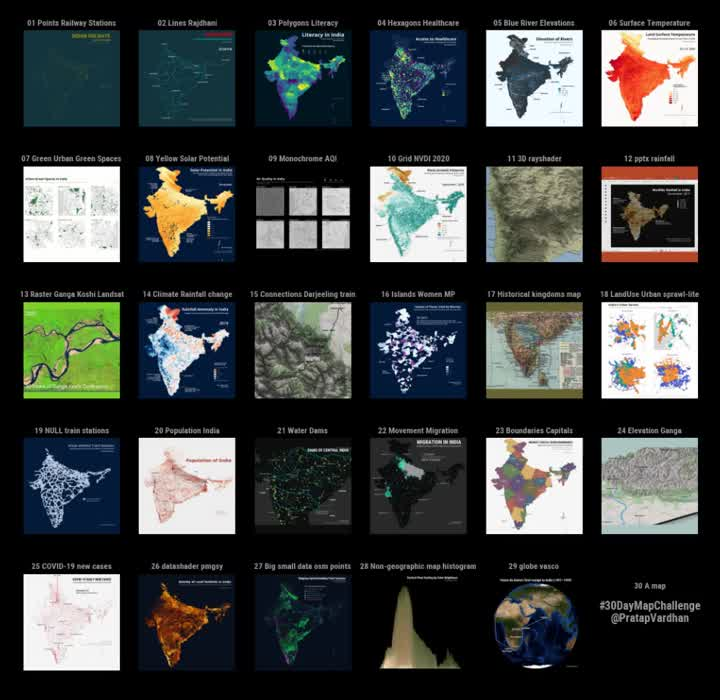

# Notebooks

A collection of Python notebooks.

- [Bar Chart Race in Python with Matplotlib](barchart-race-matplotlib.ipynb) ~In roughly less than 50 lines of code.
- [Exploratory Spatial Data Analysis with Python](exploratory-spatial-data-analysis.ipynb) - geopandas, shapely, matplotlib
- [COVID-19 Dashboards](covid19/covid19-overview.ipynb) - Tracking coronavirus total cases, deaths and new cases by country
- [Geospatial Visualizations with Matplotlib](geospatial-visualizations-matplotlib.ipynb) - Exploring India with data, maps and animations
- [Song Lyrics: Exploratory Analysis](lyrics-analysis.ipynb) - [Kanye Lyrics](https://www.kaggle.com/pratapvardhan/kanye-lyrics-eda-song-generator-topic-modelling): EDA, Song Generator, Topic Modelling
- [India's Lower Judiciary](india-lower-judiciary-states.ipynb) - [Analysis](https://pratapvardhan.com/blog/india-lower-judiciary/) of how cases are being decided in Indian lower courts
- [Morphological Gradients](http://nbviewer.ipython.org/github/pratapvardhan/iPyNotebooks/blob/master/morphological-gradients.ipynb) - skimage implementation of MM gradients.

<table>
  <tbody align="center">
    <tr>
      <td>
        <a href="barchart-race-matplotlib.ipynb" target="_blank">
          <h4>Bar Chart Race in Python with Matplotlib</h4>
          
        </a>
      </td>
      <td >
        <a href="exploratory-spatial-data-analysis.ipynb" target="_blank">
          <h4>Exploratory Spatial Data Analysis with Python</h4>
          
        </a>
      </td>
    </tr>
    <tr>
      <td>
        <a href="covid19/covid19-overview.ipynb" target="_blank">
          <h4>COVID-19 Dashboards</h4>
          
        </a>
      </td>
      <td >
        <a href="geospatial-visualizations-matplotlib.ipynb" target="_blank">
          <h4>Geospatial Visualizations with Matplotlib</h4>
          
        </a>
      </td>
    </tr>
    <tr>
      <td>
        <a href="lyrics-analysis.ipynb" target="_blank">
          <h4>Song Lyrics: Exploratory Analysis</h4>
          
        </a>
      </td>
      <td >
        <a href="india-lower-judiciary-states.ipynb" target="_blank">
          <h4>India's Lower Judiciary</h4>
          
        </a>
      </td>
    </tr>
  </tbody>
</table>
